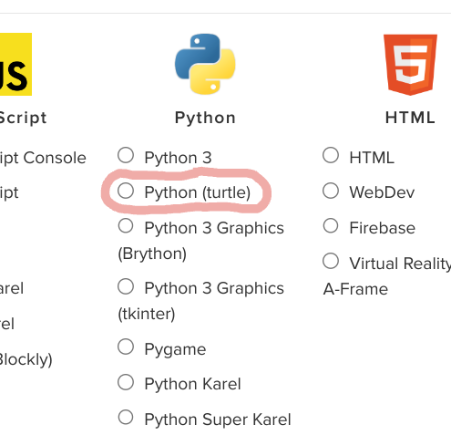

# [Link to video.](https://www.youtube.com/watch?v=lLGbfdw7lUk&list=PLVD25niNi0BkyCc47RgZHKnmIh6nsupN7)

### Turtle

Turtle is a package in the Python Standard Library. It is a graphics library used to create animated drawings. The basic premise behind Turtle is that there is a turtle 🐢 moving around the screen and leaving a trail wherever they go.

In codeHS if you want to create your own Turtle program you need to select the Python(turtle) option.




In other IDEs you would need to import the `turtle` package, create a window by calling any `Screen` method, and then use a few other functions to make sure the window operatres correctly.

By default, the window in codeHS is 400 by 400. Our shape in codeHS is represented by an turtle by default. We can change that using the `shape()` function. The options are: `"arrow"`, `"turtle"`, `"circle"`, `"square"`, `"triangle"`, `"classic"`.

```python

# Creates a turtle, but changes its representation to be a arrow
shape("arrow")

```

### More Documentation

More documentation for Turtle can be found under the Docs tab above your Output window. 
