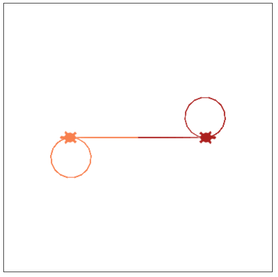

# [Link to video.](https://www.youtube.com/watch?v=Ui8ynU302Xc&list=PLVD25niNi0BkyCc47RgZHKnmIh6nsupN7)

### Multiple Turtles

So far all of our Turtle programs have had just one turtle. If we want to make more than one turtle, we can use the `Turtle()` constructor to create each one. In order to do this we need to import some more functions from the turtle library with `from turtle import *`. We can name each turtle and treat the turtle functions as turtle methods instead (i.e. use dot notation). We also need to hide the original turtle with the function `hide_turtle()`.

```python
# Importing the turtle module
from turtle import *

#removing default turtle
hide_turtle()

# Nancy the Turtle
nancy = Turtle()
nancy.shape("turtle")
nancy.speed(6)
nancy.color("firebrick")
nancy.forward(100)
nancy.circle(30)

# Arthur the Turtle
arthur = Turtle()
arthur.shape("turtle")
arthur.speed(3)
arthur.color("coral")
arthur.setheading(180)
arthur.forward(100)
arthur.circle(30)

```



We can only have one turtle moving at a time. In the example above, Nancy goes first then Arthur goes afterwards.
