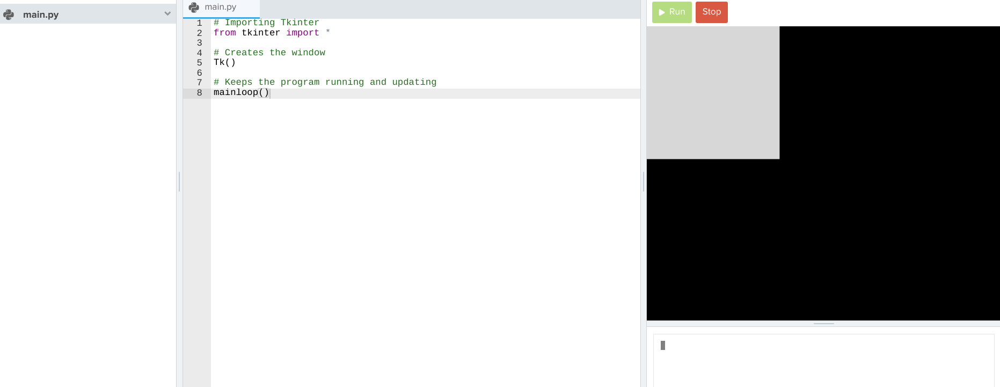

# [Link to video.](https://www.youtube.com/watch?v=xtRNSzdBsl4&list=PLVD25niNi0BlwZxjcVF6-vcOdAicWlRjC)

### Tkinter

Tkinter (pronounced "tee-kinter" or "tuh-kinter" or "tee-kay-inter", short for *Tk interface*) is a package in the Python Standard Library. Tkinter is the de facto package used to create GUIs (graphic user interfaces) in Python. A GUI (pronounced "gooey") is a way of interacting with a computer. Examples of GUIs include windows, icons, and menus.

There are a few lines of code that we need to include in every Tkinter program.

```python
# Importing Tkinter
from tkinter import *

# Creates the window
Tk()

# Keeps the program running and updating
mainloop()
```

1. We first need to import the `tkinter` package.
2. We then need to use the `Tk()` constructor to create a window to put the graphics on.
3. Lastly, we need to call `mainloop()` to keep the window displaying until we close the window or hit the Stop button.

Here is the result of this program.



### Official Documentation

Here is the official documentation for Tkinter: https://docs.python.org/3/library/tkinter.html.
