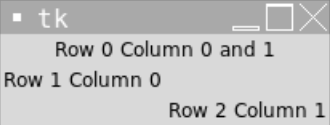

# [Link to video.](https://www.youtube.com/watch?v=PkBWtk7X9s8&list=PLVD25niNi0BlwZxjcVF6-vcOdAicWlRjC)

### The Grid System

If we use `grid()` instead of `pack()`, the widgets are arranged in a grid system. Properties of the `grid()` method include `row` for the row number (starting at 0) and `column` for the column number (starting at 0). Blank rows and blank columns take up no space where as occupied cells take up the minimum amount of space needed.

```python
from tkinter import *

# Creates the window 
window = Tk()

# Creates labels for some text to go on
label00 = Label(window, text = "Row 0 Column 0")
label00.grid(row = 0, column = 0)
label11 = Label(window, text = "Row 1 Column 1") 
label11.grid(row = 1, column = 1)
label22 = Label(window, text = "Row 2 Column 2")
label22.grid(row = 2, column = 2)  

# Keeps the program running and updating
mainloop()
```


If we want to merge cells together, we can use the `columnspan` property to indicate how many horizontally-adjacent cells to merge together.

```python
from tkinter import *

# Creates the window 
window = Tk()

# Creates labels for some text to go on
label00 = Label(window, text = "Row 0 Column 0 and 1")
label00.grid(row = 0, column = 0, columnspan = 2)

label10 = Label(window, text = "Row 1 Column 0")
label10.grid(row = 1, column = 0)

label21 = Label(window, text = "Row 2 Column 1")
label21.grid(row = 2, column = 1)

# Keeps the program running and updating
mainloop()
```



### Accesing Widget Properties

If we want to access or change the property of a widget, the syntax is similar to access a value in a dictionary by its key.

```python
from tkinter import *

# Creates the window 
window = Tk()

label = Label(window, fill = "blue", text = "hi", background = "white")

# Playing with the 'text' property
print(label["text"]) # prints 'hi'
label["text"] = "hello" # changes the 'text' property to 'hello'
print(label["text"]) # prints 'hi'

# Keeps the program running and updating
mainloop()
```

