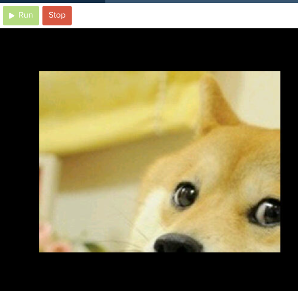

# [Link to video.](https://www.youtube.com/watch?v=tsQK786jbUg&list=PLVD25niNi0BlwZxjcVF6-vcOdAicWlRjC)

## Images in Pygame

We can import any image in a Pygame program as long as it's in a common file format such as PNG.

To use an image, we first need to upload it to Replit. Within the repl, we can drag and drop the image file under **Files** until it appear like this:


Now that our Pygame program can access the image file, here's how we can get it to show on our Pygame screen:

```python
# Initial setup
import sys, pygame
import os
os.environ['SDL_AUDIODRIVER'] = 'dsp'
pygame.init()
screen = pygame.display.set_mode((400, 300))

# Loads the image
'''The image file needs to be under "Files" (where main.py is).'''
doge = pygame.image.load("doge.png")

# Displays it with the top-left corner at (0, 0)
'''The word "blit" means to draw a graphic.'''
screen.blit(doge, (0, 0))

# Keeps the program running and updating
while True:
  pygame.display.update()
```

This will place the origin of the image (the top-left corner) at the origin of the screen (also the top-left corner).



The size of the image will not be modified to fit the screen. If the image is larger than the screen, only a portion of will appear on the screen. If we want to resize the image, we can use `transform.scale()` before `screen.blit()`:

```python
# Resizes the image to take up the entire screen
'''The parameters of transform.scale() are:
- image
- new size of the image
'''
doge = pygame.transform.scale(doge, (400, 300))
```

This will resize the dog image to be 400 pixels by 300 pixels (the size of the screen). If the original image didn't have the ratio 4:3, it will stretch the image out and possibly distort it.


We can reflect an image using `transform.flip()` after `transform.scale()` but before `screen.blit()`:

```python
'''The parameters of transform.flip() are:
- image
- True/False for left/right flipping
- True/False for up/down flipping
'''
doge = pygame.transform.flip(doge, False, True)
```


We can rotate an image using `transform.rotate()` after `transform.scale()` but before `screen.blit()`:

```python
'''The parameters of transform.rotate() are:
- image
- the number of degrees to rotate counterclockwise
'''
doge = pygame.transform.rotate(doge, 60)
```


