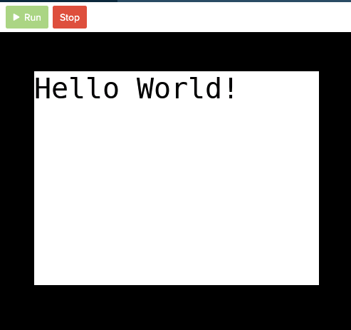
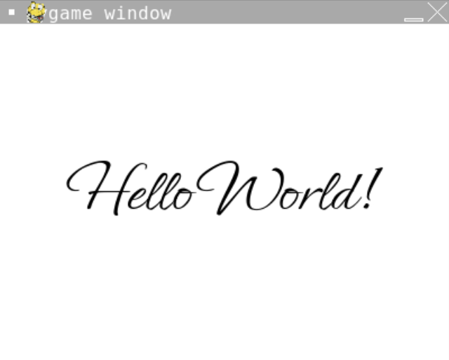
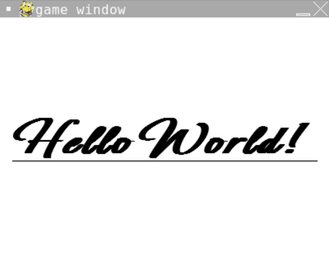

# [Link to video.](https://www.youtube.com/watch?v=amCoC07twSo&list=PLVD25niNi0BlwZxjcVF6-vcOdAicWlRjC)

### Text and Fonts in Pygame

When we put text onto a graphic in Pygame, there are several things we have to decide:

* the colour
* the font
* the font size
* any additional styling (i.e. bolding, italics, and underlining) 
* the location on the screen

### Fonts in codeHS

We can use one of four font types with pygame in codeHS:

* dejavuserif
* dejavusansmono
* dejavusans
* dejavumathtexgyre

If you were using an IDE other than codeHS you could use sites like [Google Fonts](http://fonts.google.com) to legally download these files. 

We can load the font into our program using `font.Font()` and apply it using `font.render`.

```python
# Initial setup
import sys, pygame
import os
os.environ['SDL_AUDIODRIVER'] = 'dsp'
pygame.init()
screen = pygame.display.set_mode((400, 300))

# Initializing colours (using RGB values) so we can use them later
BLACK = (0, 0, 0)
WHITE = (255, 255, 255)

# Paints the background white
screen.fill(WHITE)

# Stores the font with font size 40
'''The parameters of font.Font() are:
- the font name as a string
- the font size
'''
font = pygame.font.SysFont("dejavusansmono",40)

# Stores the text with font styling
'''The parameters of font.render() are:
- the text
- True/False depending on whether you want the text to be smooth
- the colour of the text
'''
text = font.render('Hello World!', True, BLACK)

#Shows you the four available fonts with pygame in codeHS
print(pygame.font.get_fonts())

# Places the text at the top-left
'''The parameters of screen.blit() are:
- the styled text
- the rectangle to put the text on
The function get_rect() gets a rectangle sized to
perfectly fits the text. It is located with its 
origin at the screen's origin.
'''
screen.blit(text, text.get_rect())

# Keeps the program running and updating
while True:
  pygame.display.update()
```

Here is the result:



If we want to put the text somewhere else, we can do that by changing the location of the rectangle the the text is on. We can store the rectangle as a variable and change its coordinates.

```python
# Stores the rectangle for the text
text_rectangle = text.get_rect()

# Makes the center coordinate of the rectangle the center of the screen
text_rectangle.center = (200, 150)  

# Places the text on the rectangle on the screen
screen.blit(text, text_rectangle)
```

Here is the same text but in the center of the screen:



There are many other variables to indicate the location of a rectangle.

The following can be assigned a 2-dimensional tuple.

* `topleft`
* `bottomleft`
* `topright`
* `bottomright`
* `midtop`
* `midleft`
* `midbottom`
* `midright`
* `center`

The following can be assigned to an integer, representing either an x-coordinate or y-coordinate.

* `top`
* `left`
* `bottom`
* `right`
* `centerx`
* `centery`

If we want additional styling, we can set the `bold` , `italic`, and `underline` properties of the font to be `True`. By default, they are all `False`.

We need to do these before we render the font.

```python
# Turns bolding on
ephesis_font.set_bold(True)

# Turns italics on
ephesis_font.set_italic(True)

# Turns underlining on
ephesis_font.set_underline(True)
```

Here is the same text as before but with all three additional stylings.


