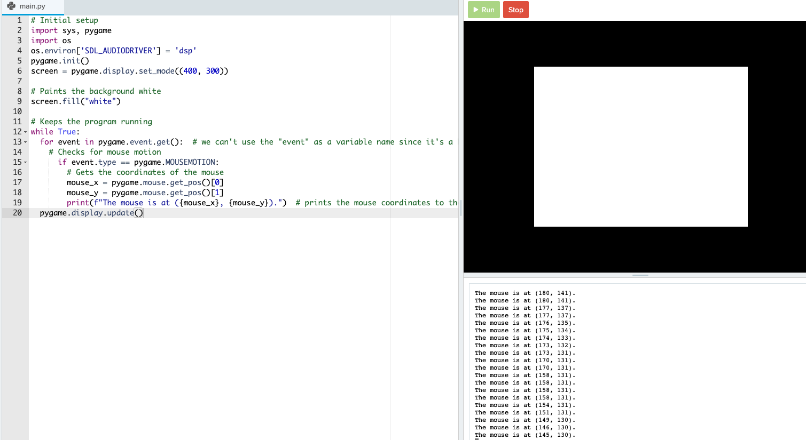
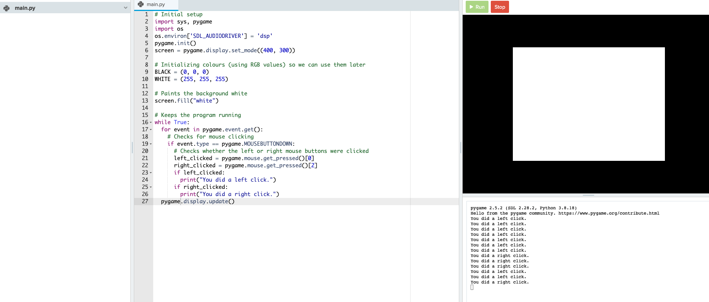

# [Link to video.](https://www.youtube.com/watch?v=u9gxpxMWva0&list=PLVD25niNi0BlwZxjcVF6-vcOdAicWlRjC)

### Mouse Interactions in Pygame

In Pygame, we can create programs that involve mouse interactions. We can control what happens on the screen with our mouse.

To do this, we check through the list `event.get()` within the infinite while loop. This list contains **events**, which include information about where the mouse cursor is and which mouse buttons have just been pressed.

These are the names of the event types we'll be using for mouse events. They are written in all capital letters since they are constants.

* `MOUSEMOTION`
* `MOUSEBUTTONUP`
* `MOUSEBUTTONDOWN`

### Mouse Movement

Here is how we can store and use the location of the mouse cursor on the screen:

```python
# Initial setup
import sys, pygame
import os
os.environ['SDL_AUDIODRIVER'] = 'dsp'
pygame.init()
screen = pygame.display.set_mode((400, 300))

# Paints the background white
screen.fill("white")

# Keeps the program running
while True:
  for event in pygame.event.get():  # we can't use the "event" as a variable name since it's a keyword in pygame
    # Checks for mouse motion
      if event.type == pygame.MOUSEMOTION:
        # Gets the coordinates of the mouse
        mouse_x = pygame.mouse.get_pos()[0]
        mouse_y = pygame.mouse.get_pos()[1]
        print(f"The mouse is at ({mouse_x}, {mouse_y}).")  # prints the mouse coordinates to the screen when the mouse moves
  pygame.display.update()
```


### Mouse Clicking

Here is how we can check whether the mouse has been left-clicked or right-clicked.

```python
# Initial setup
import sys, pygame
import os
os.environ['SDL_AUDIODRIVER'] = 'dsp'
pygame.init()
screen = pygame.display.set_mode((400, 300))

# Paints the background white
screen.fill("white")

# Keeps the program running
while True:
  for event in pygame.event.get():
    # Checks for mouse clicking
    if event.type == pygame.MOUSEBUTTONDOWN:
      # Checks whether the left or right mouse buttons were clicked
      left_clicked = pygame.mouse.get_pressed()[0]
      right_clicked = pygame.mouse.get_pressed()[2]
      if left_clicked:
        print("You did a left click.")
      if right_clicked:
        print("You did a right click.")
  pygame.display.update()
```

