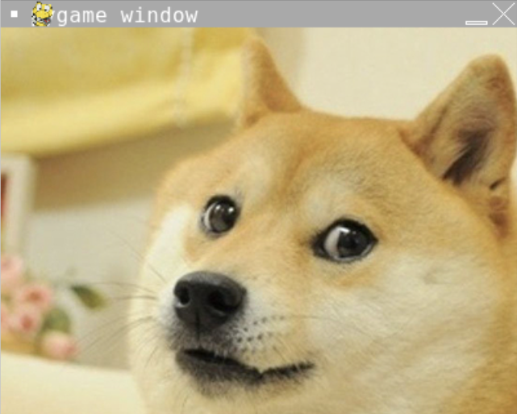
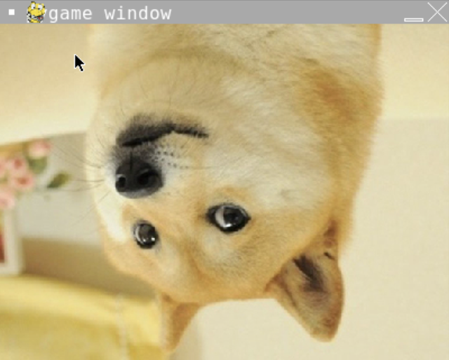
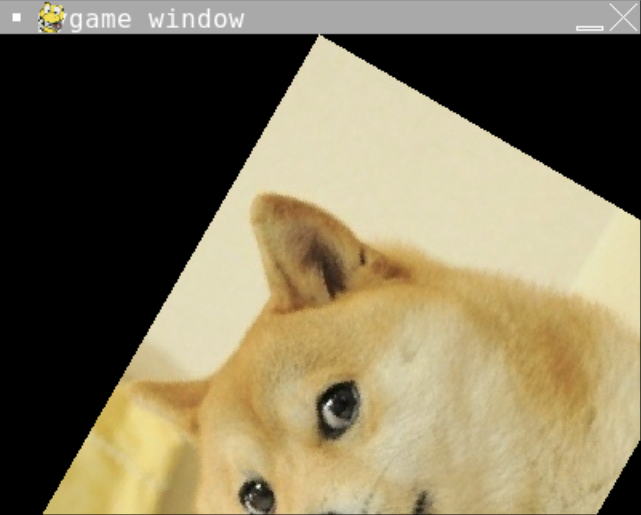

# [Link to video.](https://www.youtube.com/watch?v=tsQK786jbUg&list=PLVD25niNi0BlwZxjcVF6-vcOdAicWlRjC)

## Images in Pygame

We can import any image in a Pygame program as long as it's in a common file format such as PNG, JP(E)G, or GIF.

To use an image, we first need to upload it to Replit. Within the repl, we can drag and drop the image file under **Files** until it appear like this:


Now that our Pygame program can access the image file, here's how we can get it to show on our Pygame screen:

```python
# Initial setup
import pygame as pg

pg.init()
screen = pg.display.set_mode((400, 300))

# Loads the image
'''The image file needs to be under "Files" (where main.py is).'''
doge = pg.image.load("doge.png")

# Displays it with the top-left corner at (0, 0)
'''The word "blit" means to draw a graphic.'''
screen.blit(doge, (0, 0))

# Keeps the program running and updating
while True:
  pg.display.update()
```

This will place the origin of the image (the top-left corner) at the origin of the screen (also the top-left corner).



The size of the image will not be modified to fit the screen. If the image is larger than the screen, only a portion of will appear on the screen. If we want to resize the image, we can use `transform.scale()` before `screen.blit()`:

```python
# Resizes the image to take up the entire screen
'''The parameters of transform.scale() are:
- image
- new size of the image
'''
doge = pg.transform.scale(doge, (400, 300))
```

This will resize the dog image to be 400 pixels by 300 pixels (the size of the screen). If the original image didn't have the ratio 4:3, it will stretch the image out and possibly distort it.


We can reflect an image using `transform.flip()` after `transform.scale()` but before `screen.blit()`:

```python
'''The parameters of transform.flip() are:
- image
- True/False for left/right flipping
- True/False for up/down flipping
'''
doge = pg.transform.flip(doge, False, True)
```



We can rotate an image using `transform.rotate()` after `transform.scale()` but before `screen.blit()`:

```python
'''The parameters of transform.rotate() are:
- image
- the number of degrees to rotate counterclockwise
'''
doge = pg.transform.rotate(doge, 60)
```


