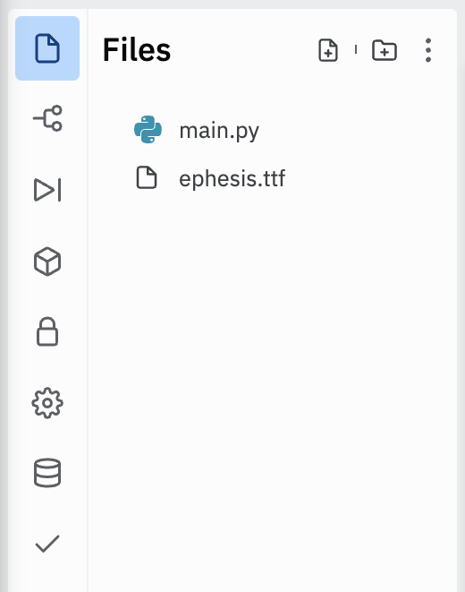

### Text and Fonts in Pygame

When we put text onto a graphic in Pygame, there are several things we have to decide:

* the colour
* the font
* the font size
* any additional styling (i.e. bolding, italics, and underlining) 
* the location on the screen

### Fonts

We can access some fonts depending on the operating system and/or IDE.

The full list of fonts can be found with `font.get_fonts()`. Here are the fonts we can access on Replit.

```
> font.get_fonts()
['dejavuserif', 'dejavusansmono', 'freesans', 'dejavusans', 'freeserif', 'freemono']
```

We can pick any of these and load it using `font.SysFont()`. 

```python
'''The parameters of font.SysFont() are:
- the name of the font
- the font size
'''
freesans_font = font.SysFont('freesans', 80)
```

We can also use any commercial-use font by uploading the .ttf (TrueType Font) or .otf (OpenType Font) file.

We can use sites like Google Fonts to legally download these files. Once we download one we can drag it under Files on our Replit project. 



### Displaying Text

Here's a program that displays "Hello World!" written in Ephesis, font size 100, in white, at the top-left corner.

```  python
# Initial setup
from pygame import *

init()
screen = display.set_mode((400, 300))

# Initializing colours (using RGB values) so we can use them later
WHITE = (255, 255, 255)

# Paints the background black
screen.fill(black)

# Stores the font Ephesis with font size 800
'''The parameters of font.Font() are:
- the ttf file of the font
- the font size
'''
ephesis_font = font.Font('ephesis.ttf', 80)

# Stores the text with font styling
'''The parameters of font.render() are:
- the text
- True/False depending on whether you want the text to be smooth
- the colour of the text
'''
text = ephesis_font.render('Hello World!', True, WHITE)

# Places the text at the top-left
'''The parameters of screen.blit() are:
- the styled text
- the rectangle to put the text on
The function get_rect() gets a rectangle sized to
perfectly fits the text. It is located with its 
origin at the screen's origin.
'''
screen.blit(text, text.get_rect())

# Keeps the program running and updating
while True:
  display.update()
  
```

Here is the result:


If we want to put the text somewhere else, we can do that by changing the location of the rectangle the the text is on. We can store the rectangle as a variable and change its coordinates.

```python
# Stores the rectangle for the text
text_rectangle = text.get_rect()

# Makes the center coordinate of the rectangle the center of the screen
text_rectangle.center = (200, 150)  

# Places the text on the rectangle on the screen
screen.blit(text, text_rectangle)
```

Here is the same text but in the center of the screen:


There are many other variables to indicate the location of a rectangle.

The following can be assigned a 2-dimensional tuple.

* `topleft`
* `bottomleft`
* `topright`
* `bottomright`
* `midtop`
* `midleft`
* `midbottom`
* `midright`
* `center`

The following can be assigned to an integer, representing either an x-coordinate or y-coordinate.

* `top`
* `left`
* `bottom`
* `right`
* `centerx`
* `centery`

If we want additional styling, we can set the `bold` , `italic`, and `underline` properties of the font to be `True`. By default, they are all `False`.

We need to do these before we render the font.

```python
# Turns bolding on
ephesis_font.set_bold(True)

# Turns italics on
ephesis_font.set_italic(True)

# Turns underlining on
ephesis_font.set_underline(True)
```

Here is the same text as before but with all three additional stylings.


