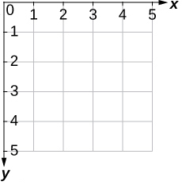

### Screen Coordinates in Tkinter

The coordinate system in programming are often different than the coordinate system used in math. 

In math, 2-dimensional coordinates can be graphed on a Cartesian Plane like this:

In computer science, we don't use the Cartesian plane for coordinates very often. We usually use this coordinate system instead:

For example, if we are referring to a specific pixel in an image, we would use this coordinate system instead of the Cartesian plane. 

The idea is that this is similar to how we would refer to cells in a table: The row number followed by column number, with Row 0 Column 0 representing the cell in the top-left corner. This is also similar to how we read in English: left to right, top to bottom.

The coordinate (0, 0) is referred to as the **origin**. In Tkinter, **the origin is always is at the top-left corner**. 

In math, the origin is at the center of the Cartesian plane. If we are only using the positive quadrant of the Cartesian plane, the origin is at the bottom-left corner.
