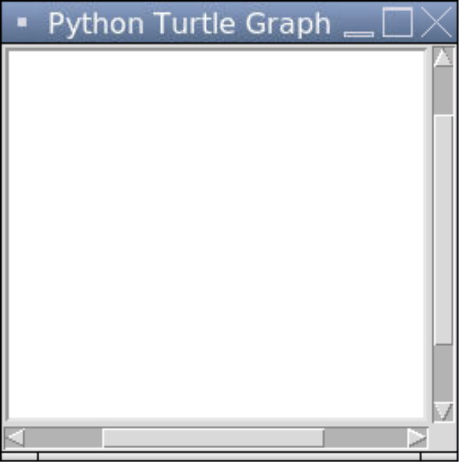
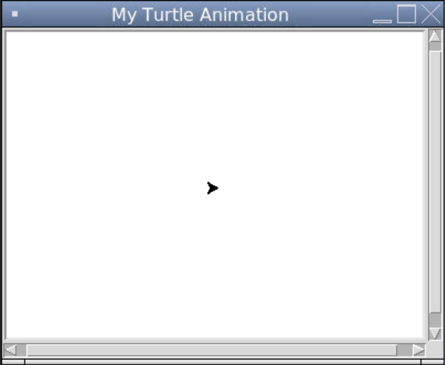
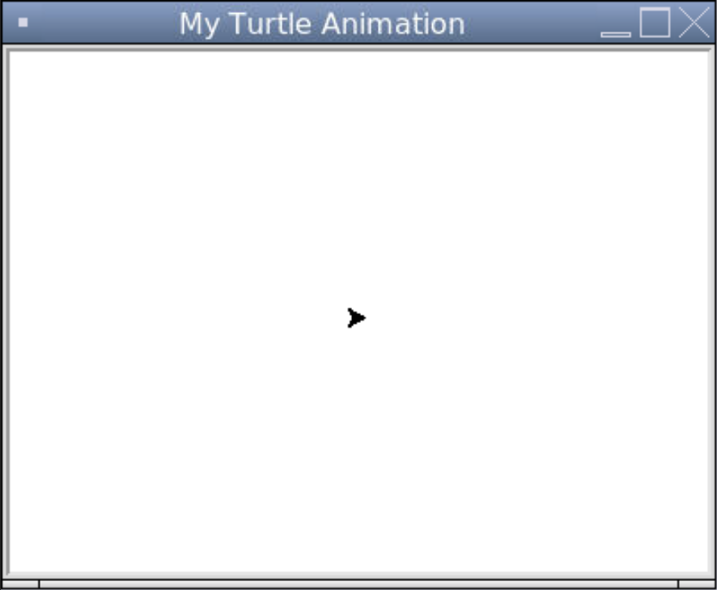

# [Link to video.](https://www.youtube.com/watch?v=ECMytTCJzmc&list=PLVD25niNi0BlCbAA1gYbX7IjwpfIQU5Eh&index=1)

### Turtle

Turtle is a package in the Python Standard Library. It is a graphics library used to create animated drawings. The basic premise behind Turtle is that there is a turtle 🐢 moving around the screen and leaving a trail wherever they go.

There are a few lines of code that we need to include in every Turtle program.

```python
# Importing the turtle module
from turtle import *

# Creates a window and keeps the window open after the drawing is complete
done()
```

1. We first need to import the `turtle` package.
2. We need to create a window by calling any `Screen` method. 
3. We then need to keep the program running so that the window keeps displaying, which is what `done()` does. This will keep the program running indefinitely until we hit the Stop button. Also, `done()` is a `Screen` method so it happens to also create the window, but usually a different function will be used to create the window.

Here is the result of this program.



By default, the window is quite small and the title of the window in the title bar in Replit is "Python Turtle Graphics". We can change the dimensions of the window using `setup()` and the title using `title()`. We can also put a turtle on the screen using `Turtle()`.

```python
# Importing the turtle module
from turtle import *

# Creates a window with the size 400 by 300 and sets the title
setup(400, 300)
title("My Turtle Animation")

# Creates a turtle object and puts it on the window
Turtle()

# Keeps the program running after the drawing is complete
done()
```



Sometimes we see horizontal and vertical scrollbars. This is because our window size isn't strictly less than the default canvas size. We can remove the scrollbars by redefining the default canvas width and height in a dictionary called `_CFG` (short for *configuration*) to be really small. 

```python
# Importing the turtle module
from turtle import *
from turtle import _CFG  # this dictionary to be imported separately

# Resizes the default canvas size to prevent scrollbars
_CFG["canvwidth"] = 1 
_CFG["canvheight"] = 1

# Creates a window with the size 400 by 300 and sets the title
setup(400, 300)
title("My Turtle Animation")

# Creates a turtle object 
Turtle()

# Keeps the program running after the drawing is complete
done()
```



Our `Turtle` object is represented by an arrow by default. We can change that using the `shape()` function. The options are: `"arrow"`, `"turtle"`, `"circle"`, `"square"`, `"triangle"`, `"classic"`. We can also change its size using `turtlesize()` which takes three parameters: the width, height, and border thickness in pixels. When we call these functions, we no longer have to write `Turtle()`.

```python
# Importing the turtle module
from turtle import *
from turtle import _CFG  # we need this to remove the scrollbars

# Resizes the default canvas size to prevent scrollbars
_CFG["canvwidth"] = 1 
_CFG["canvheight"] = 1

# Creates a window with the size 400 by 300 and sets the title
setup(400, 300)
title("My Turtle Animation")

# Creates a Turtle object, changes its representation to be a turtle, and makes it bigger
shape("turtle")
turtlesize(2, 2, 1)

# Keeps the program running after the drawing is complete
done()
```


### Official Documentation

Here is the official documentation for Turtle: https://docs.python.org/3/library/turtle.html.
