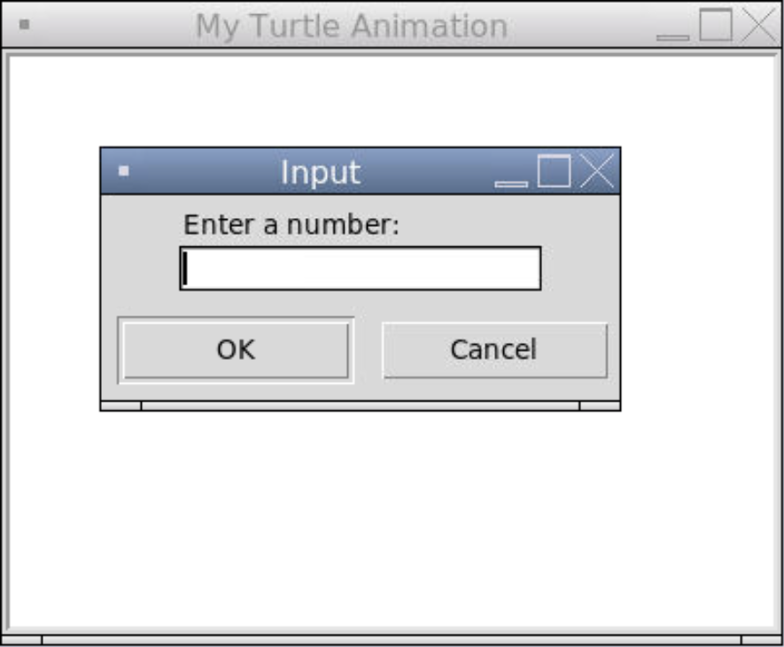
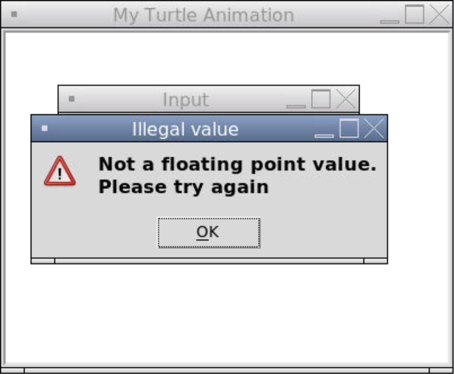

scrollbars### User Input in Turtle

In Turtle, we can prompt the user for input through a popup window. We can use `textinput()` or `numinput()`.

With `textinput()` we can prompt the user to enter some text and it will be parsed as a string. This function takes two arguments: the title of the popup window and the text to display as a prompt.

```python
# Importing the turtle module
from turtle import *
from turtle import _CFG  # we need this to remove the scrollers

# Resizes the default canvas size to prevent scrollers
_CFG["canvwidth"] = 1 
_CFG["canvheight"] = 1

# Creates a window with the size 400 by 300 and sets the title
setup(400, 300)
title("My Turtle Animation")

# Prompts the user
direction = textinput("Input", "Enter 'left' or 'right': ")

# Goes east or west depending on the user input
if direction == "right":
  forward(100)
elif direction == "left":
  left(180)
  forward(100)

# Hides the turtle after they are done drawing
hideturtle()

# Keeps the program running after the drawing is complete
done()
```


With `numinput()` we can prompt the user to enter some text and it will be parsed as a float. This function takes the same arguments as `textinput()`.

```python
# Importing the turtle module
from turtle import *
from turtle import _CFG  # we need this to remove the scrollers

# Resizes the default canvas size to prevent scrollers
_CFG["canvwidth"] = 1 
_CFG["canvheight"] = 1

# Creates a window with the size 400 by 300 and sets the title
setup(400, 300)
title("My Turtle Animation")

# Prompts the user
distance = numinput("Input", "Enter a number: ")

# Goes eastward the number of pixels specified by the user
forward(distance)

# Hides the turtle after they are done drawing
hideturtle()

# Keeps the program running after the drawing is complete
done()
```



If the user enters something that cannot be parsed as float, an error window pops up.


